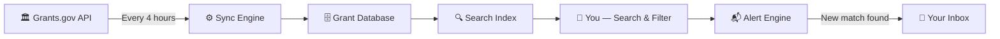

<div align="center">

<!-- ══════════════════════════════════════════════════════════ -->
<!--                  ANIMATED HEADER BANNER                   -->
<!-- ══════════════════════════════════════════════════════════ -->


<!-- ══════════════════════════════════════════════════════════ -->
<!--                     TYPING ANIMATION                      -->
<!-- ══════════════════════════════════════════════════════════ -->

<a href="https://grantarchive.com" target="_blank">
  
</a>

<br/>

<!-- ══════════════════════════════════════════════════════════ -->
<!--                        BADGES ROW                         -->
<!-- ══════════════════════════════════════════════════════════ -->

<p>
  <a href="https://grantarchive.com" target="_blank">
    
  </a>
  &nbsp;
  <a href="https://grantarchive.com/grants" target="_blank">
    
  </a>
  &nbsp;
  <a href="https://grantarchive.com/register" target="_blank">
    
  </a>
  &nbsp;
  
</p>

<p>
  
  &nbsp;
  
  &nbsp;
  
  &nbsp;
  
  &nbsp;
  
</p>

<br/>

</div>

---

<!-- ══════════════════════════════════════════════════════════ -->
<!--                     LIVE STATS STRIP                      -->
<!-- ══════════════════════════════════════════════════════════ -->

<div align="center">

### 📊 Live Platform Snapshot

<table>
  <tr>
    <td align="center" width="200">
      
      <br/>
      
      <br/><sub><b>Active opportunities right now</b></sub>
    </td>
    <td align="center" width="200">
      
      <br/><sub><b>Total funding available</b></sub>
    </td>
    <td align="center" width="200">
      
      <br/><sub><b>NIH, NSF, DOE, USDA & more</b></sub>
    </td>
    <td align="center" width="200">
      
      <br/><sub><b>Always fresh data</b></sub>
    </td>
  </tr>
</table>

</div>

---

<!-- ══════════════════════════════════════════════════════════ -->
<!--                      WHAT IS THIS?                        -->
<!-- ══════════════════════════════════════════════════════════ -->

## 🏛️ What is GrantArchive?

> **GrantArchive.com** is the fastest, most comprehensive **US Federal Grants intelligence platform** — built for nonprofits, researchers, grant writers, and institutions who can't afford to miss funding opportunities.

We pull live data from **Grants.gov** every 4 hours, structure it, and make it instantly searchable — so you spend less time navigating bureaucratic portals and more time writing winning proposals.

```
╔══════════════════════════════════════════════════════════════╗
║   You Search "education grants nonprofits texas"            ║
║         ↓                                                   ║
║   GrantArchive returns 40+ matching opportunities           ║
║   → Sorted by deadline · Filterable by award size           ║
║   → Save search · Set alerts · Export CSV                   ║
║         ↓                                                   ║
║   You get notified the moment new grants are posted         ║
╚══════════════════════════════════════════════════════════════╝
```

---

<!-- ══════════════════════════════════════════════════════════ -->
<!--                    WHO IS IT FOR?                         -->
<!-- ══════════════════════════════════════════════════════════ -->

## 🎯 Who Uses GrantArchive?

<div align="center">

<table>
  <thead>
    <tr>
      <th>👤 User Type</th>
      <th>🔍 Their Problem</th>
      <th>✅ How GrantArchive Solves It</th>
    </tr>
  </thead>
  <tbody>
    <tr>
      <td><b>🏢 Nonprofits</b></td>
      <td>Grants.gov is slow & hard to navigate</td>
      <td>Clean search UI + deadline alerts by email</td>
    </tr>
    <tr>
      <td><b>✍️ Grant Writers</b></td>
      <td>Manually tracking 50+ agencies for new postings</td>
      <td>Saved searches + instant notifications</td>
    </tr>
    <tr>
      <td><b>🔬 Researchers</b></td>
      <td>Missing NIH/NSF cycles due to no alerting system</td>
      <td>Agency-specific filters + deadline calendar</td>
    </tr>
    <tr>
      <td><b>🏫 Universities</b></td>
      <td>Multiple departments need different grant feeds</td>
      <td>Team plans with org profiles & exports</td>
    </tr>
    <tr>
      <td><b>🏛️ Institutions</b></td>
      <td>Need programmatic access to grant data</td>
      <td>API access + webhooks + bulk CSV export</td>
    </tr>
  </tbody>
</table>

</div>

---

<!-- ══════════════════════════════════════════════════════════ -->
<!--                      KEY FEATURES                         -->
<!-- ══════════════════════════════════════════════════════════ -->

## ⚡ Core Features

<div align="center">

```
┌─────────────────────────────────────────────────────────────┐
│                    GRANTARCHIVE FEATURES                    │
├──────────────────────┬──────────────────────────────────────┤
│  🔍 SMART SEARCH     │  Full-text + filter by agency,       │
│                      │  category, award size, deadline,     │
│                      │  state, eligibility type             │
├──────────────────────┼──────────────────────────────────────┤
│  📬 EMAIL ALERTS     │  Get notified when new grants match  │
│                      │  your saved search criteria          │
├──────────────────────┼──────────────────────────────────────┤
│  📅 DEADLINE TRACKER │  Calendar view of closing dates —    │
│                      │  7-day and 1-day reminders           │
├──────────────────────┼──────────────────────────────────────┤
│  📊 GRANT ANALYTICS  │  Historical trends, agency patterns, │
│                      │  funding cycle predictions           │
├──────────────────────┼──────────────────────────────────────┤
│  📁 EXPORT & API     │  Download CSV, generate PDF reports, │
│                      │  or access via REST API + webhooks   │
├──────────────────────┼──────────────────────────────────────┤
│  🏢 TEAM WORKSPACE   │  Multi-org profiles, shared saved    │
│                      │  searches, team-level access control │
└──────────────────────┴──────────────────────────────────────┘
```

</div>

<br/>

<details>
<summary><b>🔍 Smart Grant Search — Click to expand</b></summary>
<br/>

Filter grants by **any combination** of:

| Filter | Options |
|--------|---------|
| 🏛️ **Federal Agency** | NIH, NSF, DOE, USDA, HUD, SBA, and 20+ more |
| 📂 **Funding Category** | Health, Education, Science, Agriculture, Arts, Housing… |
| 💰 **Award Size** | Min/Max award ceiling and floor |
| 🗓️ **Deadline Range** | Closing within 7 days, 30 days, or custom range |
| 🗺️ **State** | State-specific eligibility |
| 🏷️ **Instrument Type** | Grants, Cooperative Agreements, Contracts |
| 👥 **Applicant Type** | Nonprofits, Universities, Small Businesses, Individuals |

</details>

<details>
<summary><b>📬 Smart Email Alerts — Click to expand</b></summary>
<br/>

1. **Save any search** with your exact filter criteria
2. Choose alert frequency: **daily** or **weekly**
3. Receive a digest email with all new matching grants
4. One-click to view full details on any opportunity

> Never manually check for new postings again.

</details>

<details>
<summary><b>📊 Historical Intelligence — Click to expand</b></summary>
<br/>

GrantArchive doesn't just show you what's open today — it builds a **historical database** of every grant ever posted:

- 📈 See **funding trends** by agency and category over time
- 🔮 Predict when grants will be posted next cycle
- 🔎 Research how much an agency typically awards
- 📉 Spot emerging funding priorities before your competitors

</details>

---

<!-- ══════════════════════════════════════════════════════════ -->
<!--                    PRICING SECTION                        -->
<!-- ══════════════════════════════════════════════════════════ -->

## 💳 Pricing — Simple & Transparent

<div align="center">

<table>
  <thead>
    <tr>
      <th>🆓 Free</th>
      <th>📅 Monthly</th>
      <th>⭐ Yearly <kbd>BEST VALUE</kbd></th>
    </tr>
  </thead>
  <tbody>
    <tr>
      <td align="center"><b>$0</b><br/><sub>Forever free</sub></td>
      <td align="center"><b>$14.99/mo</b><br/><sub>3-day free trial</sub></td>
      <td align="center"><b>$99/year</b><br/><sub>7-day free trial · Save 45%+</sub></td>
    </tr>
    <tr>
      <td>✅ Browse all grants<br/>✅ Basic keyword search<br/>✅ View grant details<br/>❌ No card required</td>
      <td>✅ Everything in Free<br/>✅ Saved searches<br/>✅ Email alerts<br/>✅ Deadline calendar<br/>✅ CSV export</td>
      <td>✅ Everything in Monthly<br/>✅ Historical database<br/>✅ Agency analytics<br/>✅ PDF reports<br/>✅ Priority support</td>
    </tr>
    <tr>
      <td align="center">
        <a href="https://grantarchive.com" target="_blank">
          
        </a>
      </td>
      <td align="center">
        <a href="https://grantarchive.com/register" target="_blank">
          
        </a>
      </td>
      <td align="center">
        <a href="https://grantarchive.com/register" target="_blank">
          
        </a>
      </td>
    </tr>
  </tbody>
</table>

> 💡 **No credit card required to start.** The yearly plan is our most popular — it pays for itself the moment you land your first grant.

</div>

---

<!-- ══════════════════════════════════════════════════════════ -->
<!--                    TECH STACK / HOW IT WORKS              -->
<!-- ══════════════════════════════════════════════════════════ -->

## 🛠️ How GrantArchive Works



<br/>

<div align="center">

| Layer | Technology |
|-------|-----------|
| 🖥️ **Backend** | PHP · Symfony · Doctrine ORM |
| 🗄️ **Database** | PostgreSQL with full-text search |
| ⚡ **Cache** | Redis for high-performance queries |
| 🎨 **Frontend** | Tailwind CSS · Alpine.js |
| 📬 **Email** | Automated digest + alert system |
| 🔄 **Data Sync** | Cron-driven Grants.gov API sync (4h interval) |
| 🌍 **Hosting** | Production-grade cloud infrastructure |

</div>

---

<!-- ══════════════════════════════════════════════════════════ -->
<!--                      QUICK START                          -->
<!-- ══════════════════════════════════════════════════════════ -->

## 🚀 Get Started in 60 Seconds

```bash
# Step 1 — Visit GrantArchive
open https://grantarchive.com

# Step 2 — Search for your grants
# (No account needed for basic browsing)

# Step 3 — Create a free account to save searches & get alerts
# → https://grantarchive.com/register

# Step 4 — Save your first search
# Set filters → Click "Save & Alert" → Choose frequency

# Step 5 — Let GrantArchive work for you 🎉
# New matching grants land in your inbox automatically
```

---

<!-- ══════════════════════════════════════════════════════════ -->
<!--                    AGENCY COVERAGE                        -->
<!-- ══════════════════════════════════════════════════════════ -->

## 🏛️ Federal Agencies We Track

<div align="center">

`NIH` &nbsp;·&nbsp; `NSF` &nbsp;·&nbsp; `DOE` &nbsp;·&nbsp; `USDA` &nbsp;·&nbsp; `DOD` &nbsp;·&nbsp; `HUD` &nbsp;·&nbsp; `DOT` &nbsp;·&nbsp; `EPA` &nbsp;·&nbsp; `NEA` &nbsp;·&nbsp; `NEH`

`SBA` &nbsp;·&nbsp; `HRSA` &nbsp;·&nbsp; `SAMHSA` &nbsp;·&nbsp; `CDC` &nbsp;·&nbsp; `FEMA` &nbsp;·&nbsp; `EDA` &nbsp;·&nbsp; `IES` &nbsp;·&nbsp; `IMLS` &nbsp;·&nbsp; `ACF` &nbsp;·&nbsp; `OJP`

**+ 6 more agencies and growing**

</div>

---

<!-- ══════════════════════════════════════════════════════════ -->
<!--                     GRANT CATEGORIES                      -->
<!-- ══════════════════════════════════════════════════════════ -->

## 📂 Funding Categories

<div align="center">

| 🏥 Health | 🎓 Education | 🌱 Environment | 🔬 Science & Technology |
|-----------|-------------|----------------|------------------------|
| Public health initiatives | K-12 & higher ed programs | Climate & conservation | Basic research & R&D |
| Mental health & substance abuse | Workforce development | Energy efficiency | STEM programs |
| Rural health clinics | Early childhood learning | Natural disaster mitigation | Advanced manufacturing |

| 🏘️ Housing & Community | 🚜 Agriculture | 🎨 Arts & Culture | ⚖️ Justice |
|----------------------|---------------|-------------------|-----------|
| Affordable housing | Rural development | NEA & NEH grants | Criminal justice reform |
| Urban revitalization | Food assistance | Cultural preservation | Youth programs |
| Community development | Agricultural research | Public broadcasting | Victim services |

</div>

---

<!-- ══════════════════════════════════════════════════════════ -->
<!--                    FAQ / COMMON QUESTIONS                 -->
<!-- ══════════════════════════════════════════════════════════ -->

## ❓ Frequently Asked Questions

<details>
<summary><b>Is GrantArchive free to use?</b></summary>
<br/>
Yes! Browsing and basic search are completely free with no credit card required. Paid plans unlock saved searches, email alerts, deadline calendars, exports, and more.
</details>

<details>
<summary><b>How current is the grant data?</b></summary>
<br/>
Very current. We sync directly from the official Grants.gov API every <b>4 hours</b>. New grant postings appear on GrantArchive within hours of being published federally.
</details>

<details>
<summary><b>Do you show only federal grants?</b></summary>
<br/>
Currently yes — we cover the complete catalog of US federal grant opportunities from Grants.gov. This includes grants from all major federal agencies (NIH, NSF, DOE, USDA, DOD, and 20+ more).
</details>

<details>
<summary><b>How do email alerts work?</b></summary>
<br/>
You save a search with your preferred filters (agency, category, keyword, award size, etc.). Every time a new grant is posted that matches your criteria, we send you a notification — daily or weekly, your choice.
</details>

<details>
<summary><b>Can my team use GrantArchive together?</b></summary>
<br/>
Yes! Our yearly plan supports team workspaces with multiple organizational profiles, shared saved searches, and collaborative access — perfect for grant writing teams and development departments.
</details>

<details>
<summary><b>Is there an API for programmatic access?</b></summary>
<br/>
Yes. We offer REST API access with webhook support for platforms and institutions that need to integrate grant data into their own systems. <a href="https://grantarchive.com">Contact us</a> for API plan details.
</details>

---

<!-- ══════════════════════════════════════════════════════════ -->
<!--                   USE CASE EXAMPLES                       -->
<!-- ══════════════════════════════════════════════════════════ -->

## 💡 Real-World Use Cases

<div align="center">

```
┌────────────────────────────────────────────────────────────────────┐
│ 🏥 NONPROFIT HEALTH CLINIC in rural Texas                         │
│                                                                    │
│ Search: "rural health clinic funding Texas"                        │
│ Result: 12 matching HRSA & HHS grants — 3 closing this month      │
│ Action: Save search → Set weekly alert → Apply before deadlines   │
└────────────────────────────────────────────────────────────────────┘

┌────────────────────────────────────────────────────────────────────┐
│ 🔬 UNIVERSITY RESEARCH DEPARTMENT                                 │
│                                                                    │
│ Search: "NIH neuroscience basic research 2025"                    │
│ Result: 38 NIH opportunities with full synopsis & deadlines       │
│ Action: Export CSV → Brief PI team → Track 5 key opportunities    │
└────────────────────────────────────────────────────────────────────┘

┌────────────────────────────────────────────────────────────────────┐
│ ✍️ GRANT WRITER managing 8 nonprofit clients                      │
│                                                                    │
│ Action: Create 8 saved searches (one per client focus area)       │
│ Result: Single inbox digest covering all 8 clients daily          │
│ Impact: Hours of manual research → automated intelligence         │
└────────────────────────────────────────────────────────────────────┘
```

</div>

---

<!-- ══════════════════════════════════════════════════════════ -->
<!--                  COMPARISON TABLE                         -->
<!-- ══════════════════════════════════════════════════════════ -->

## 🆚 GrantArchive vs. Grants.gov

<div align="center">

| Feature | 🏛️ Grants.gov | ⭐ GrantArchive |
|---------|--------------|----------------|
| Search speed | 🐢 Slow, clunky UI | ⚡ Instant, filtered |
| Email alerts | ❌ None | ✅ Smart, keyword-matched |
| Saved searches | ❌ None | ✅ Unlimited (paid) |
| Mobile-friendly | ❌ Barely | ✅ Fully responsive |
| Deadline calendar | ❌ None | ✅ Visual calendar view |
| CSV export | ❌ None | ✅ One-click export |
| Historical data | ❌ Removed after close | ✅ Permanent archive |
| Agency analytics | ❌ None | ✅ Trends & patterns |
| API access | ⚠️ Complex registration | ✅ Simple REST API |
| **Cost** | Free | **Free to start** |

</div>

---

<!-- ══════════════════════════════════════════════════════════ -->
<!--                   TESTIMONIALS                            -->
<!-- ══════════════════════════════════════════════════════════ -->

## 💬 What Users Say

<div align="center">

> *"GrantArchive saved us hours of searching. We found the perfect NIH grant in minutes."*
>
> **— Sarah K., Research Director**

---

> *"The email alerts are a game-changer. New grants matching our criteria land right in our inbox."*
>
> **— Mark T., Nonprofit Executive Director**

---

> *"Clean interface, fast search, and great filtering. Way better than navigating Grants.gov directly."*
>
> **— Jennifer R., Grant Writer**

</div>

---

<!-- ══════════════════════════════════════════════════════════ -->
<!--                   POPULAR SEARCHES                        -->
<!-- ══════════════════════════════════════════════════════════ -->

## 🔥 Popular Grant Searches

<div align="center">

[](https://grantarchive.com/grants?category=education)
[](https://grantarchive.com/grants?category=health)
[](https://grantarchive.com/grants?agency=NIH)
[](https://grantarchive.com/grants?agency=NSF)
[](https://grantarchive.com/grants?agency=USDA)
[](https://grantarchive.com/grants?agency=HUD)
[](https://grantarchive.com/grants?agency=NEA)
[](https://grantarchive.com/grants?category=science)
[](https://grantarchive.com/grants?agency=SBA)
[](https://grantarchive.com/grants?agency=EPA)

</div>

---

<!-- ══════════════════════════════════════════════════════════ -->
<!--                      CONNECT / CTA                        -->
<!-- ══════════════════════════════════════════════════════════ -->

## 🌐 Connect & Get Started

<div align="center">

<br/>

[](https://grantarchive.com)
&nbsp;&nbsp;
[](https://grantarchive.com/grants)
&nbsp;&nbsp;
[](https://grantarchive.com/register)

<br/><br/>

<table>
  <tr>
    <td align="center">
      <b>🌍 Website</b><br/>
      <a href="https://grantarchive.com">grantarchive.com</a>
    </td>
    <td align="center">
      <b>🔍 Search Grants</b><br/>
      <a href="https://grantarchive.com/grants">grantarchive.com/grants</a>
    </td>
    <td align="center">
      <b>📬 Set Up Alerts</b><br/>
      <a href="https://grantarchive.com/register">grantarchive.com/register</a>
    </td>
  </tr>
</table>

<br/>

---

<sub>
  <b>GrantArchive</b> is not affiliated with or endorsed by Grants.gov or any US federal agency.<br/>
  Data is sourced from the official Grants.gov public API and refreshed every 4 hours.<br/><br/>
  <a href="https://grantarchive.com">grantarchive.com</a> · The Smarter Way to Find Federal Grants
</sub>

<br/><br/>


</div>